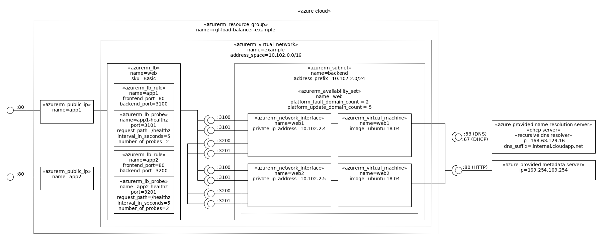

an example azure load balancer



# Usage (on a Ubuntu Desktop)

Install the tools:

```bash
./provision-tools.sh
```

Login into azure-cli:

```bash
az login
```

List the subscriptions and select the current one if the default is not OK:

```bash
az account list
az account set --subscription=<id>
```

Review `main.tf` and maybe change the `location` variable.

Initialize terraform:

```bash
make terraform-init
```

Launch the example:

```bash
make terraform-apply
```

Using the Azure Portal, run the `provision-web.sh` script in the `web1` virtual machine to launch an example web server.

Using a web browser, access the `web` load balancer IP, and see it show a page from `web1` virtual machine.

Repeat for the `web2` virtual machine and see it periodically changing from showing a page from `web1` and `web2` virtual machine. You can test with:

```bash
while true; do wget -qO- http://<web load balancer ip address>/test | grep VM; sleep .1; done
```

# Reference

* [Azure Load Balancer](https://docs.microsoft.com/en-us/azure/load-balancer/)
* [Manage the availability of Linux virtual machines](https://docs.microsoft.com/en-us/azure/virtual-machines/linux/manage-availability)
* [Business continuity and disaster recovery (BCDR): Azure Paired Regions](https://docs.microsoft.com/en-us/azure/best-practices-availability-paired-regions)
